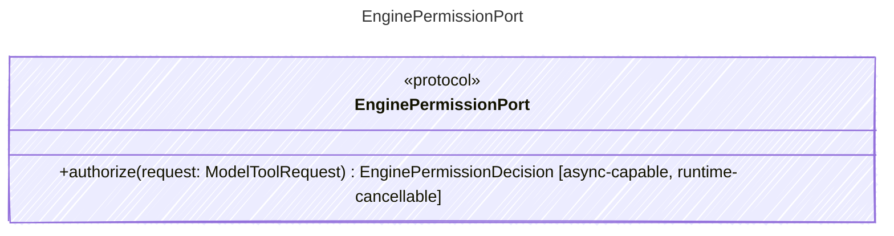

<!-- <auto-generated by typra-emitter> -->

Authorizes model-requested tools at a runtime cancellation boundary.

## Class Diagram

## Helper Methods

The following helper methods are declared via `@method` and must be implemented by every runtime. The schema declares the logical protocol contract; each runtime maps async-capable methods to idiomatic sync/async shapes for that language.

| Name | Signature | Runtime shape | Description |
| ---- | --------- | ------------- | ----------- |
| `authorize` | `authorize(request: ModelToolRequest) -> EnginePermissionDecision` | async-capable, runtime-cancellable | Authorize one model-requested tool before execution |
