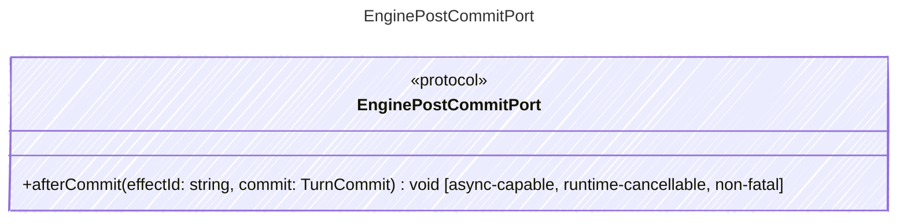

<!-- <auto-generated by typra-emitter> -->

Runs non-fatal host effects after a turn is durably committed.

## Class Diagram

## Helper Methods

The following helper methods are declared via `@method` and must be implemented by every runtime. The schema declares the logical protocol contract; each runtime maps async-capable methods to idiomatic sync/async shapes for that language.

| Name | Signature | Runtime shape | Description |
| ---- | --------- | ------------- | ----------- |
| `afterCommit` | `afterCommit(effectId: string, commit: TurnCommit) -> void` | async-capable, runtime-cancellable, non-fatal | Run one idempotent host effect after the turn is durably committed |
