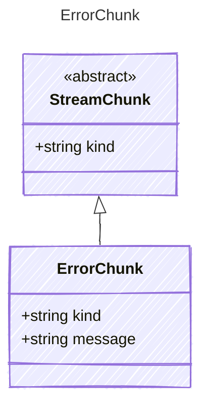

An error chunk from the LLM response stream.

## Class Diagram



## Yaml Example

```yaml
message: Rate limit exceeded
```

## Properties

| Name | Type | Description |
| ---- | ---- | ----------- |
| kind | string | The kind identifier for error chunks |
| message | string | The error message |
