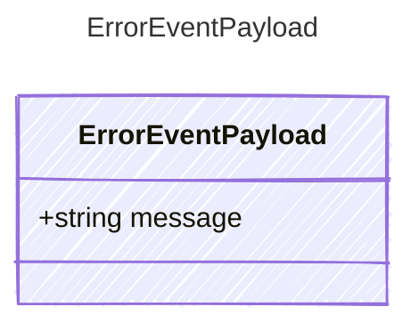

Payload for "error" events — an error occurred during the loop.

## Class Diagram



## Yaml Example

```yaml
message: Rate limit exceeded
```

## Properties

| Name | Type | Description |
| ---- | ---- | ----------- |
| message | string | Human-readable error description |
