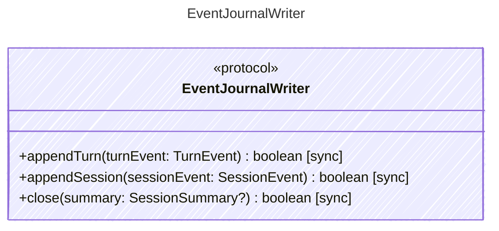

<!-- <auto-generated by typra-emitter> -->
---
title: "EventJournalWriter"
description: "Documentation for the EventJournalWriter type."
slug: "reference/eventjournalwriter"
---

Persists typed events to a durable replay journal.

## Class Diagram

## Helper Methods

The following helper methods are declared via `@method` and must be implemented by every runtime. The schema declares the logical protocol contract; each runtime maps async-capable methods to idiomatic sync/async shapes for that language.

| Name | Signature | Runtime shape | Description |
| ---- | --------- | ------------- | ----------- |
| `appendTurn` | `appendTurn(turnEvent: TurnEvent) -> boolean` | sync | Append a turn event to a durable replay journal |
| `appendSession` | `appendSession(sessionEvent: SessionEvent) -> boolean` | sync | Append a session event to a durable replay journal |
| `close` | `close(summary: SessionSummary?) -> boolean` | sync | Finalize the journal with an optional session summary |
