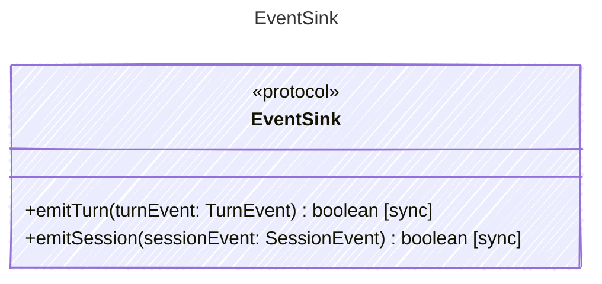

<!-- <auto-generated by typra-emitter> -->
---
title: "EventSink"
description: "Documentation for the EventSink type."
slug: "reference/eventsink"
---

Receives typed turn and session events from a harness.

## Class Diagram

## Helper Methods

The following helper methods are declared via `@method` and must be implemented by every runtime. The schema declares the logical protocol contract; each runtime maps async-capable methods to idiomatic sync/async shapes for that language.

| Name | Signature | Runtime shape | Description |
| ---- | --------- | ------------- | ----------- |
| `emitTurn` | `emitTurn(turnEvent: TurnEvent) -> boolean` | sync | Emit a typed turn event to a host sink |
| `emitSession` | `emitSession(sessionEvent: SessionEvent) -> boolean` | sync | Emit a typed session event to a host sink |
