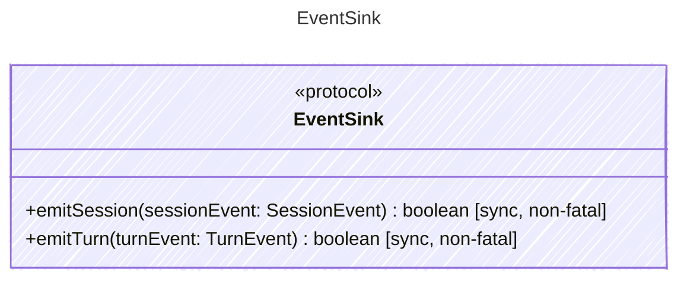

<!-- <auto-generated by typra-emitter> -->

Receives typed turn and session events from a harness.

## Class Diagram

```mermaid
---
title: EventSink
config:
  look: handDrawn
  theme: colorful
  class:
    hideEmptyMembersBox: true
---
classDiagram
    class EventSink {
      <<protocol>>
        +emitSession(sessionEvent: SessionEvent) boolean [sync, non-fatal]
        +emitTurn(turnEvent: TurnEvent) boolean [sync, non-fatal]
    }
```

## Helper Methods

The following helper methods are declared via `@method` and must be implemented by every runtime. The schema declares the logical protocol contract; each runtime maps async-capable methods to idiomatic sync/async shapes for that language.

| Name | Signature | Runtime shape | Description |
| ---- | --------- | ------------- | ----------- |
| `emitSession` | `emitSession(sessionEvent: SessionEvent) -> boolean` | sync, non-fatal | Emit a typed session event to a host sink |
| `emitTurn` | `emitTurn(turnEvent: TurnEvent) -> boolean` | sync, non-fatal | Emit a typed turn event to a host sink |
