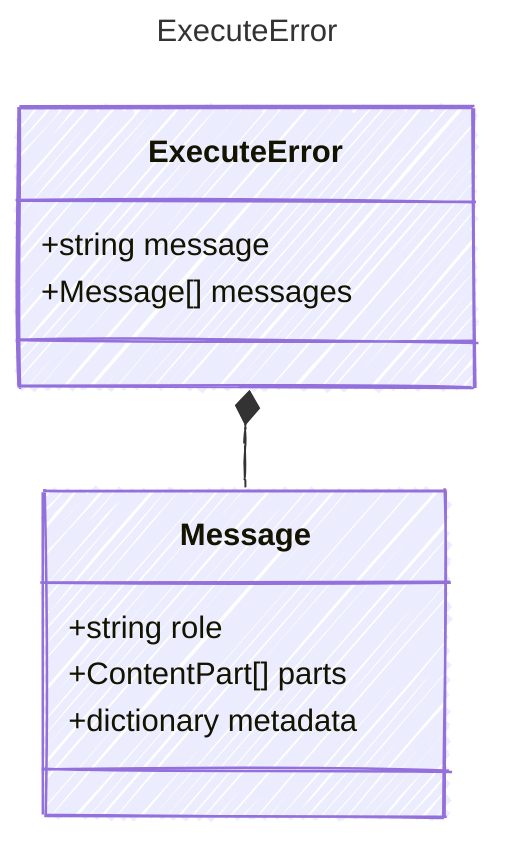

Data carried by an ExecuteError — raised when the LLM call fails
after exhausting all retry attempts. Implementations wrap this in
the language-appropriate exception type while preserving the
accumulated conversation state for recovery or debugging.

## Class Diagram



## Yaml Example

```yaml
message: "LLM call failed after 3 retries: rate limit exceeded"
messages:
  - role: system
    parts:
      - kind: text
        value: You are a helpful assistant.
  - role: user
    parts:
      - kind: text
        value: Hello
```

## Properties

| Name | Type | Description |
| ---- | ---- | ----------- |
| message | string | Human-readable error description including retry count and underlying cause |
| messages | [Message[]](../message/) | The full conversation state at the time of failure, enabling the caller to retry with the accumulated messages |

## Composed Types

The following types are composed within `ExecuteError`:

- [Message](../message/)
