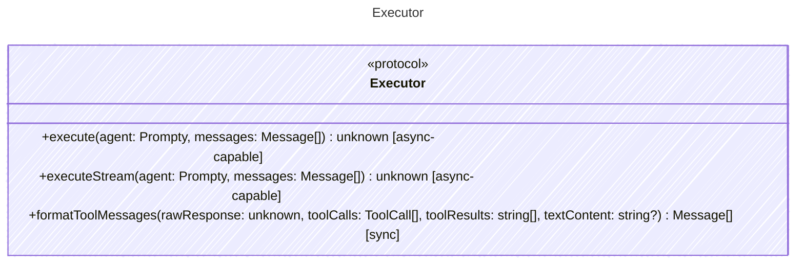

<!-- <auto-generated by typra-emitter> -->

Calls an LLM provider with messages and returns the raw provider response.

## Class Diagram

## Helper Methods

The following helper methods are declared via `@method` and must be implemented by every runtime. The schema declares the logical protocol contract; each runtime maps async-capable methods to idiomatic sync/async shapes for that language.

| Name | Signature | Runtime shape | Description |
| ---- | --------- | ------------- | ----------- |
| `execute` | `execute(agent: Prompty, messages: Message[]) -> unknown` | async-capable | Call an LLM provider with messages and return the raw response |
| `executeStream` | `executeStream(agent: Prompty, messages: Message[]) -> unknown` | async-capable _(optional default)_ | Call an LLM provider and return a streaming response. Returns a language-specific async iterable/stream of raw chunks. Not all providers support streaming; the default implementation should signal lack of support. |
| `formatToolMessages` | `formatToolMessages(rawResponse: unknown, toolCalls: ToolCall[], toolResults: string[], textContent: string?) -> Message[]` | sync | Format tool call results into messages for the next iteration |
