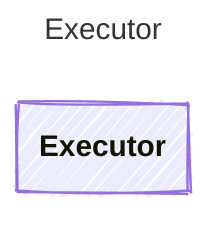

Calls an LLM provider with messages and returns the raw provider response.

## Class Diagram

## Helper Methods

The following helper methods are declared via `@method` and must be implemented by every runtime. Idiomatic language shape (e.g. zero-param accessor may be a property) is chosen per-language by the emitter.

| Name | Signature | Description |
| ---- | --------- | ----------- |
| `execute` | `execute(agent: Prompty, messages: Message[]) -> unknown` | Call an LLM provider with messages and return the raw response |
| `executeStream` | `executeStream(agent: Prompty, messages: Message[]) -> unknown` _(optional)_ | Call an LLM provider and return a streaming response. Returns a language-specific async iterable/stream of raw chunks. Not all providers support streaming; the default implementation should signal lack of support. |
| `formatToolMessages` | `formatToolMessages(rawResponse: unknown, toolCalls: ToolCall[], toolResults: string[], textContent: string?) -> Message[]` _(sync)_ | Format tool call results into messages for the next iteration |
