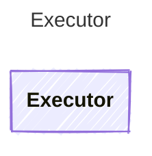

Calls an LLM provider with messages and returns the raw provider response.

## Class Diagram

```mermaid
---
title: Executor
config:
  look: handDrawn
  theme: colorful
  class:
    hideEmptyMembersBox: true
---
classDiagram
    class Executor {
    }
```
