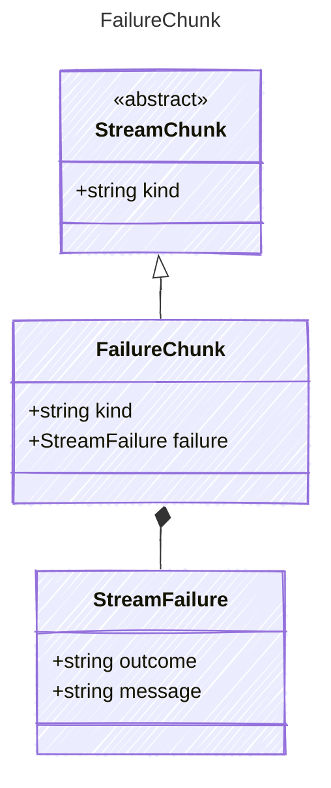

<!-- <auto-generated by typra-emitter> -->

A classified failure chunk from the LLM response stream.

## Class Diagram

## Properties

| Name | Type | Description |
| ---- | ---- | ----------- |
| kind | string | The kind identifier for classified failure chunks |
| failure | [StreamFailure](../streamfailure/) | The classified stream failure |

## Composed Types

The following types are composed within `FailureChunk`:

- [StreamFailure](../streamfailure/)
