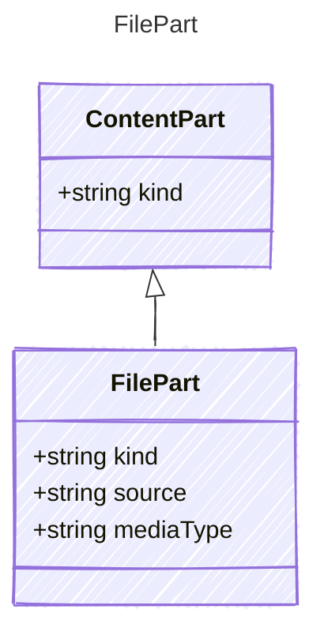

A file content part. The source may be a URL or base64-encoded data.

## Class Diagram



## Yaml Example

```yaml
source: https://example.com/document.pdf
mediaType: application/pdf
```

## Properties

| Name | Type | Description |
| ---- | ---- | ----------- |
| kind | string | The kind identifier for file content |
| source | string | URL or base64-encoded file data |
| mediaType | string | MIME type of the file (e.g., 'application/pdf') |
