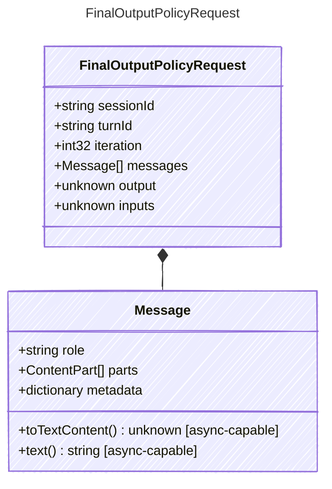

<!-- <auto-generated by typra-emitter> -->

Final output supplied to the host policy immediately before a success commit.

## Class Diagram

## Properties

| Name | Type | Description |
| ---- | ---- | ----------- |
| sessionId | string | Stable session identifier |
| turnId | string | Stable turn identifier |
| iteration | int32 | Zero-based model loop iteration |
| messages | [Message[]](../message/) | Canonical messages at commit time |
| output | unknown | Proposed final output |
| inputs | unknown | Turn inputs |

## Composed Types

The following types are composed within `FinalOutputPolicyRequest`:

- [Message](../message/)
