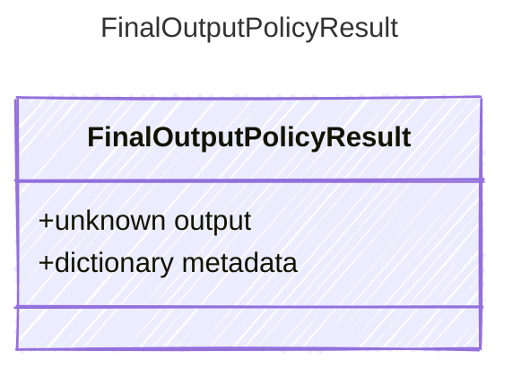

<!-- <auto-generated by typra-emitter> -->

Final output rewrite produced by the host policy before commit.

## Class Diagram

## Properties

| Name | Type | Description |
| ---- | ---- | ----------- |
| output | unknown | Rewritten final output |
| metadata | dictionary | Opaque host-specific policy metadata |
