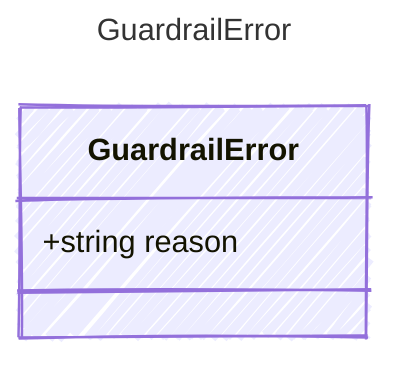

Data carried by a GuardrailError — raised when an input or output
guardrail denies content. The reason field explains the denial
for logging, UI display, or programmatic handling.

## Class Diagram



## Yaml Example

```yaml
reason: Content contains personally identifiable information
```

## Properties

| Name | Type | Description |
| ---- | ---- | ----------- |
| reason | string | Explanation of why the guardrail denied the content |
