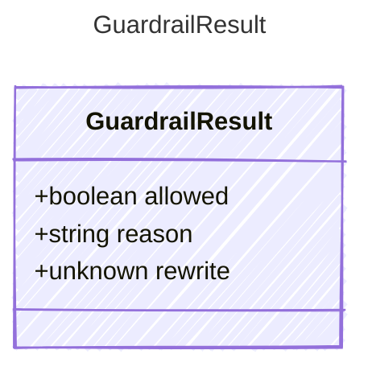

The result of a guardrail evaluation. Guardrails are safety checks that
run at specific phases of the agent loop and can allow, deny, or rewrite
content.

## Class Diagram



## Yaml Example

```yaml
allowed: true
reason: Content is safe
```

## Properties

| Name | Type | Description |
| ---- | ---- | ----------- |
| allowed | boolean | Whether the content passed the guardrail check |
| reason | string | Explanation of why the content was allowed or denied |
| rewrite | unknown | Optional rewritten content to replace the original |
