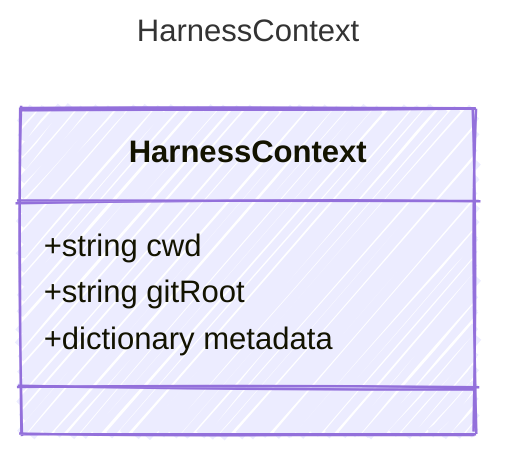

Execution context associated with a harness session. Host-specific
environments can store detailed profiles in metadata without making the core
contract depend on one source-control provider or workspace shape.

## Class Diagram



## Yaml Example

```yaml
cwd: /workspace/project
gitRoot: /workspace/project
```

## Properties

| Name | Type | Description |
| ---- | ---- | ----------- |
| cwd | string | Current working directory for the harness |
| gitRoot | string | Git repository root, when known |
| metadata | dictionary | Host-defined context metadata, such as source-control or sandbox details |
