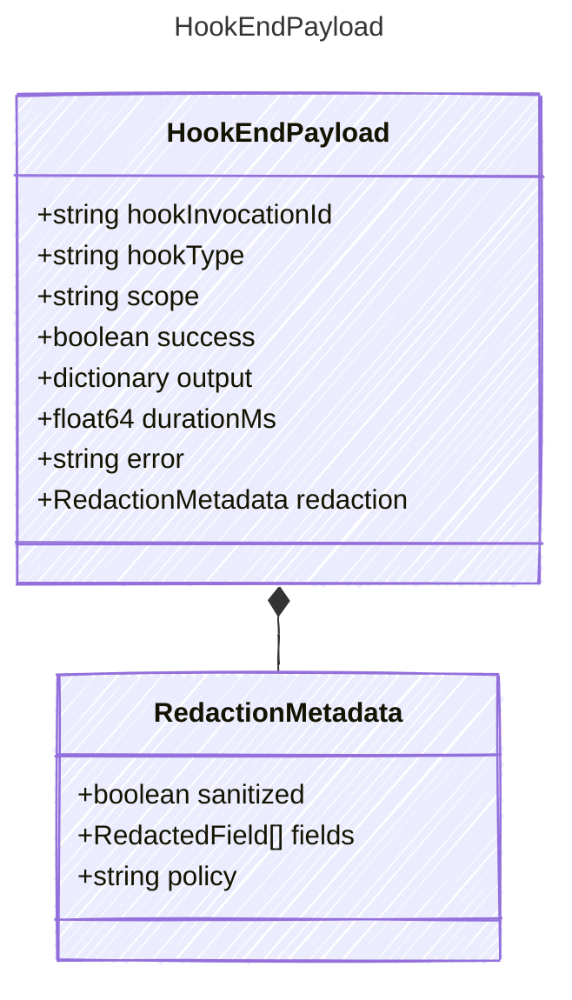

<!-- <auto-generated by typra-emitter> -->

Payload for "hook_end" events — a host lifecycle hook finished.

## Class Diagram



## Yaml Example

```yaml
hookInvocationId: hook_abc123
hookType: preToolUse
success: true
durationMs: 12
error: hook failed
```

## Properties

| Name | Type | Description |
| ---- | ---- | ----------- |
| hookInvocationId | string | Stable hook invocation identifier |
| hookType | string | Host-defined hook type |
| scope | string | Whether the hook is scoped to a turn or the outer session |
| success | boolean | Whether the hook completed successfully |
| output | dictionary | Hook output after host-side sanitization |
| durationMs | float64 | Hook execution duration in milliseconds |
| error | string | Human-readable error when success is false |
| redaction | [RedactionMetadata](../redactionmetadata/) | Redaction state for sensitive hook output fields |

## Composed Types

The following types are composed within `HookEndPayload`:

- [RedactionMetadata](../redactionmetadata/)
