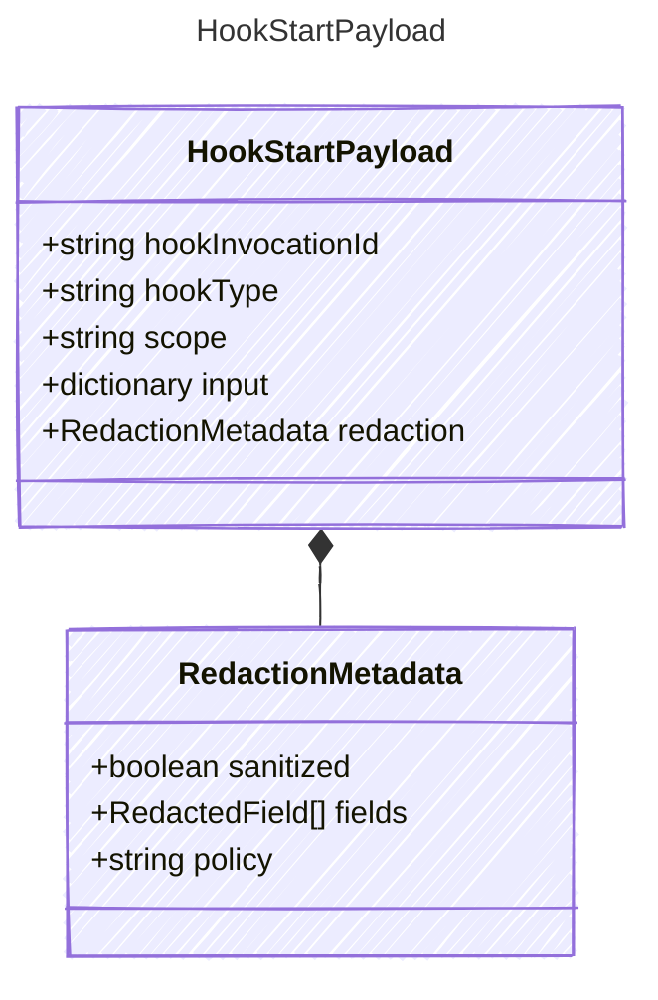

<!-- <auto-generated by typra-emitter> -->

Payload for "hook_start" events — a host lifecycle hook is beginning.

## Class Diagram



## Yaml Example

```yaml
hookInvocationId: hook_abc123
hookType: preToolUse
```

## Properties

| Name | Type | Description |
| ---- | ---- | ----------- |
| hookInvocationId | string | Stable hook invocation identifier |
| hookType | string | Host-defined hook type |
| scope | string | Whether the hook is scoped to a turn or the outer session |
| input | dictionary | Hook input after host-side sanitization |
| redaction | [RedactionMetadata](../redactionmetadata/) | Redaction state for sensitive hook input fields |

## Composed Types

The following types are composed within `HookStartPayload`:

- [RedactionMetadata](../redactionmetadata/)
