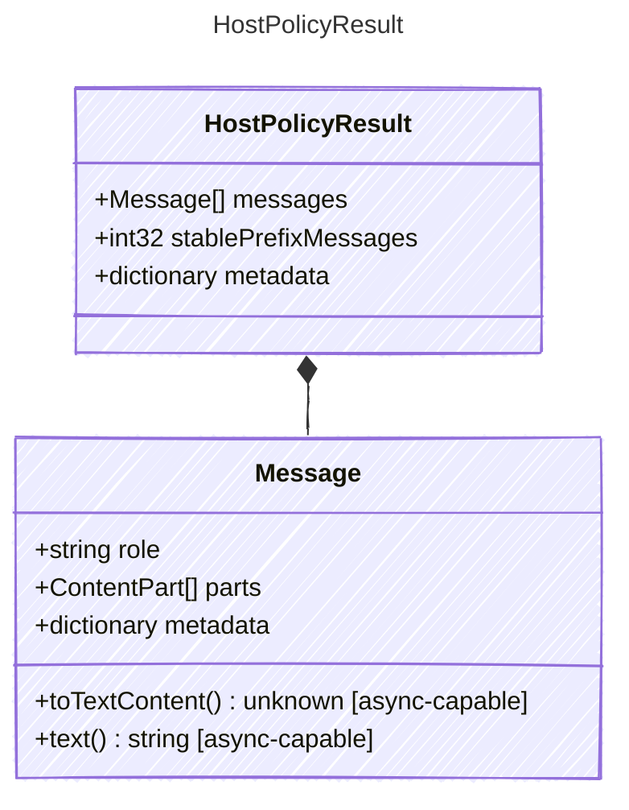

<!-- <auto-generated by typra-emitter> -->

State rewrite produced by the host policy before a model invocation.

## Class Diagram

## Properties

| Name | Type | Description |
| ---- | ---- | ----------- |
| messages | [Message[]](../message/) | Canonical messages to use for the invocation |
| stablePrefixMessages | int32 | Number of leading messages eligible for provider prefix-cache reuse |
| metadata | dictionary | Opaque host-specific policy metadata |

## Composed Types

The following types are composed within `HostPolicyResult`:

- [Message](../message/)
