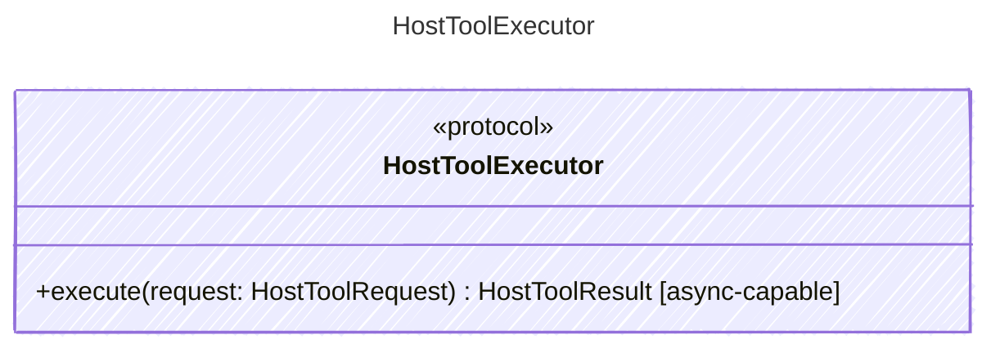

Executes host tools after policy and permission checks.

## Class Diagram

## Helper Methods

The following helper methods are declared via `@method` and must be implemented by every runtime. The schema declares the logical protocol contract; each runtime maps async-capable methods to idiomatic sync/async shapes for that language.

| Name | Signature | Runtime shape | Description |
| ---- | --------- | ------------- | ----------- |
| `execute` | `execute(request: HostToolRequest) -> HostToolResult` | async-capable | Execute a concrete host tool request and return its completion payload |
