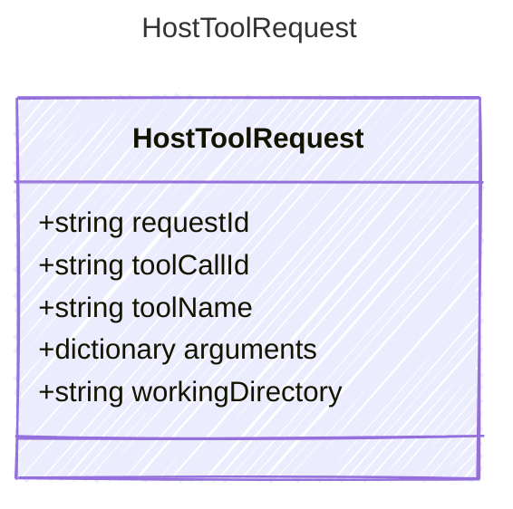

<!-- <auto-generated by typra-emitter> -->
---
title: "HostToolRequest"
description: "Documentation for the HostToolRequest type."
slug: "reference/hosttoolrequest"
---

Request passed to a host tool executor after policy and permission checks.

## Class Diagram



## Yaml Example

```yaml
requestId: exec_abc123
toolCallId: call_abc123
toolName: powershell
workingDirectory: /workspace/project
```

## Properties

| Name | Type | Description |
| ---- | ---- | ----------- |
| requestId | string | Stable host execution request identifier |
| toolCallId | string | Associated model tool call identifier, when available |
| toolName | string | Name of the host tool being executed |
| arguments | dictionary | Tool arguments after host-side sanitization |
| workingDirectory | string | Working directory or execution scope for the tool |
