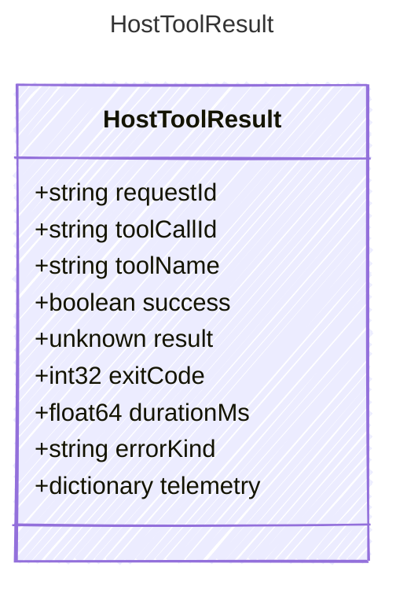

<!-- <auto-generated by typra-emitter> -->

Result returned by a host tool executor.

## Class Diagram



## Yaml Example

```yaml
requestId: exec_abc123
toolCallId: call_abc123
toolName: powershell
success: true
exitCode: 0
durationMs: 250
errorKind: timeout
```

## Properties

| Name | Type | Description |
| ---- | ---- | ----------- |
| requestId | string | Stable host execution request identifier |
| toolCallId | string | Associated model tool call identifier, when available |
| toolName | string | Name of the host tool that executed |
| success | boolean | Whether the host execution completed successfully |
| result | unknown | Host-normalized execution result |
| exitCode | int32 | Process or host exit code, when applicable |
| durationMs | float64 | Tool execution duration in milliseconds |
| errorKind | string | Machine-readable error category when success is false |
| telemetry | dictionary | Host-specific telemetry for the execution |
