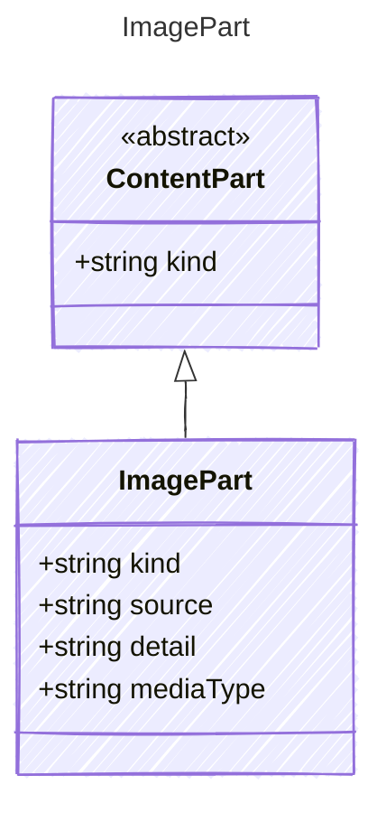

<!-- <auto-generated by typra-emitter> -->

An image content part. The source may be a URL or base64-encoded data.

## Class Diagram



## Yaml Example

```yaml
source: https://example.com/image.png
detail: auto
mediaType: image/png
```

## Properties

| Name | Type | Description |
| ---- | ---- | ----------- |
| kind | string | The kind identifier for image content |
| source | string | URL or base64-encoded image data |
| detail | string | Detail level hint for the model (e.g., 'auto', 'low', 'high') |
| mediaType | string | MIME type of the image (e.g., 'image/png') |
