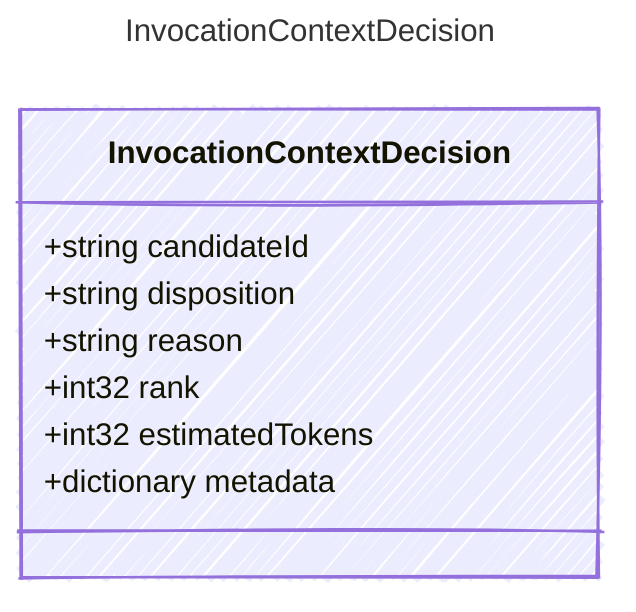

<!-- <auto-generated by typra-emitter> -->

An auditable decision made while preparing model-visible context.

## Class Diagram



## Yaml Example

```yaml
candidateId: memory:project-plan
reason: included by relevance ranking
```

## Properties

| Name | Type | Description |
| ---- | ---- | ----------- |
| candidateId | string | Stable identifier of the evaluated context candidate |
| disposition | string | Whether the candidate was included in the invocation context |
| reason | string | Human-readable reason for the disposition |
| rank | int32 | Zero-based rank among included candidates, when applicable |
| estimatedTokens | int32 | Estimated token count for the candidate, when available |
| metadata | dictionary | Opaque host-specific decision metadata |
