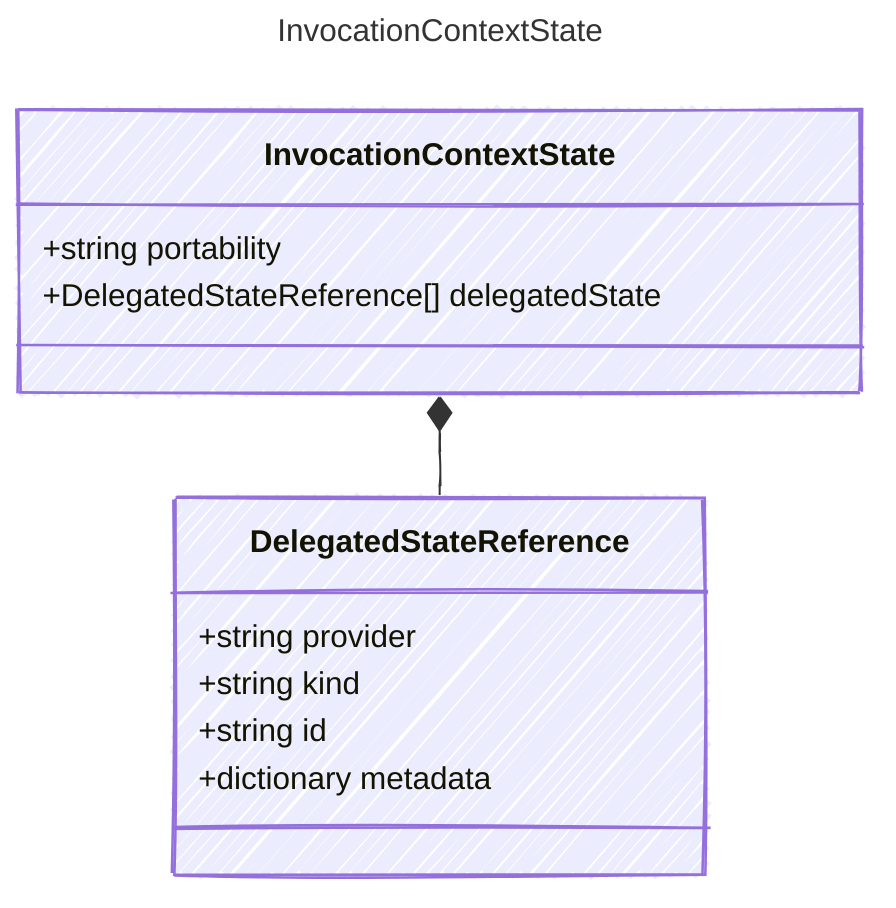

<!-- <auto-generated by typra-emitter> -->

Provider-context state carried into or out of an invocation.

## Class Diagram

## Properties

| Name | Type | Description |
| ---- | ---- | ----------- |
| portability | string | Whether the model-visible context is portable across providers |
| delegatedState | [DelegatedStateReference[]](../delegatedstatereference/) | Explicit references to provider-held context state |

## Composed Types

The following types are composed within `InvocationContextState`:

- [DelegatedStateReference](../delegatedstatereference/)
