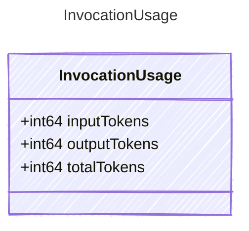

<!-- <auto-generated by typra-emitter> -->

Complete cumulative token usage for one completed model invocation.

Providers emit this value at most once per invocation. `totalTokens` uses
the provider total when available; otherwise the provider adapter computes
it as `inputTokens + outputTokens`.

## Class Diagram



## Yaml Example

```yaml
inputTokens: 150
outputTokens: 42
totalTokens: 192
```

## Properties

| Name | Type | Description |
| ---- | ---- | ----------- |
| inputTokens | int64 | Number of input tokens consumed by the completed invocation |
| outputTokens | int64 | Number of output tokens generated by the completed invocation |
| totalTokens | int64 | Total tokens consumed by the completed invocation |
