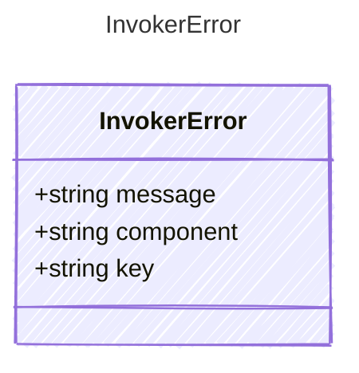

<!-- <auto-generated by typra-emitter> -->

Raised when no invoker implementation is registered for a given component
and key. For example, if no renderer is registered for the key "jinja2",
an InvokerError is raised.

## Class Diagram



## Yaml Example

```yaml
message: "No renderer registered for key: jinja2"
component: renderer
key: jinja2
```

## Properties

| Name | Type | Description |
| ---- | ---- | ----------- |
| message | string | Human-readable error message |
| component | string | The pipeline component type that was being looked up (e.g., 'renderer', 'parser', 'executor', 'processor') |
| key | string | The registration key that was not found |
