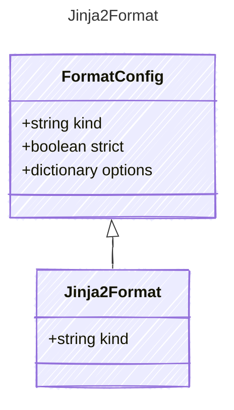

<!-- <auto-generated by typra-emitter> -->

Jinja2 template dialect. Pin-only subtype.

## Class Diagram

## Properties

| Name | Type | Description |
| ---- | ---- | ----------- |
| kind | string | The Jinja2 format discriminator |
