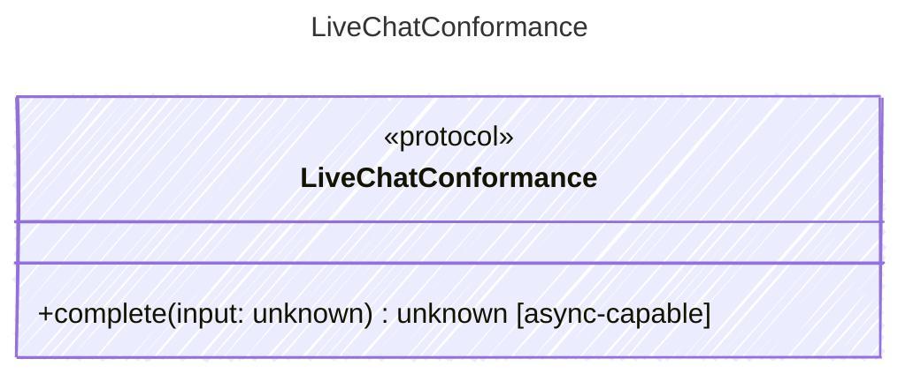

<!-- <auto-generated by typra-emitter> -->

Conformance-only seam hosting the "service drill" vectors: a conformance
vector that crosses the REAL Executor->Processor transport seam instead of
stopping at the SDK edge. A drill runs against a live provider when
credentials are present and REPLAYS a recorded cassette when they are not;
the live<->replay parity is the gate.

Like every other conformance seam this interface exists purely to carry

## Class Diagram

## Helper Methods

The following helper methods are declared via `@method` and must be implemented by every runtime. The schema declares the logical protocol contract; each runtime maps async-capable methods to idiomatic sync/async shapes for that language.

| Name | Signature | Runtime shape | Description |
| ---- | --------- | ------------- | ----------- |
| `complete` | `complete(input: unknown) -> unknown` | async-capable | Drive a real chat completion across the transport seam (live or cassette-replay) and assert 3 planes |
