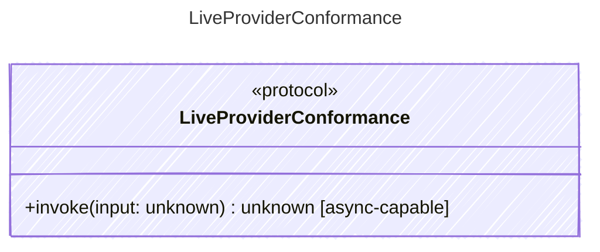

<!-- <auto-generated by typra-emitter> -->

Conformance-only seam for opt-in live provider acceptance probes.

Deterministic wire vectors own the canonical request bodies. These vectors
run only when their declared provider credentials/capabilities are present
and assert that the real provider accepts the runtime's request today.

## Class Diagram

## Helper Methods

The following helper methods are declared via `@method` and must be implemented by every runtime. The schema declares the logical protocol contract; each runtime maps async-capable methods to idiomatic sync/async shapes for that language.

| Name | Signature | Runtime shape | Description |
| ---- | --------- | ------------- | ----------- |
| `invoke` | `invoke(input: unknown) -> unknown` | async-capable | Invoke a live provider and return structural acceptance evidence |
