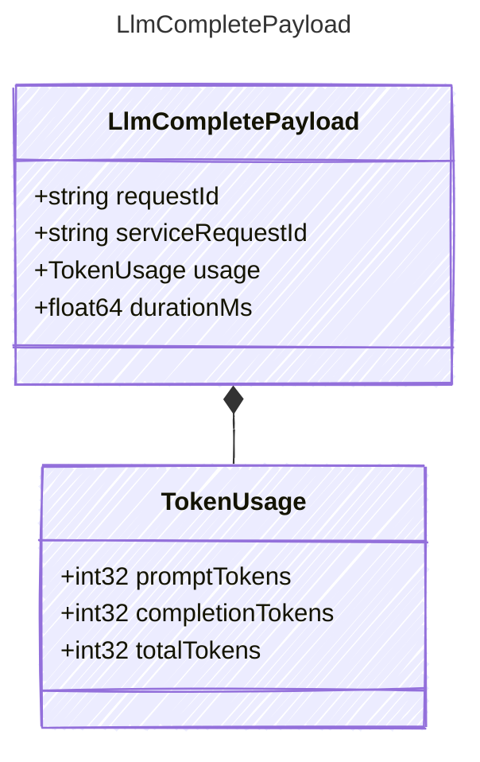

<!-- <auto-generated by typra-emitter> -->
---
title: "LlmCompletePayload"
description: "Documentation for the LlmCompletePayload type."
slug: "reference/llmcompletepayload"
---

Payload for "llm_complete" events — an LLM request completed.

## Class Diagram



## Yaml Example

```yaml
requestId: req_abc123
serviceRequestId: srv_abc123
durationMs: 820
```

## Properties

| Name | Type | Description |
| ---- | ---- | ----------- |
| requestId | string | Provider request identifier, when supplied by the SDK/API |
| serviceRequestId | string | Service request identifier, when supplied by the SDK/API |
| usage | [TokenUsage](../tokenusage/) | Token usage reported by the provider |
| durationMs | float64 | LLM call duration in milliseconds |

## Composed Types

The following types are composed within `LlmCompletePayload`:

- [TokenUsage](../tokenusage/)
