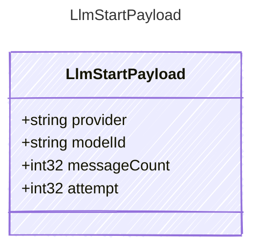

Payload for "llm_start" events — an LLM request is about to be sent.

## Class Diagram



## Yaml Example

```yaml
provider: openai
modelId: gpt-4o-mini
messageCount: 4
attempt: 0
```

## Properties

| Name | Type | Description |
| ---- | ---- | ----------- |
| provider | string | Provider identifier used for the request |
| modelId | string | Model or deployment identifier used for the request |
| messageCount | int32 | Number of messages sent to the provider |
| attempt | int32 | Retry attempt number, zero for the initial attempt |
