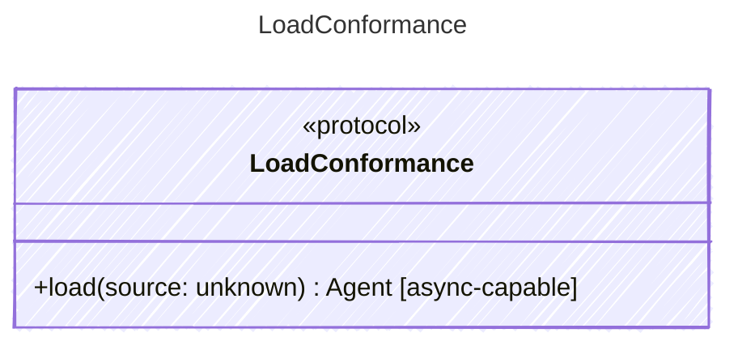

<!-- <auto-generated by typra-emitter> -->

Conformance-only seam that hosts the loader behavior vectors. Loading a
.prompty document (frontmatter + body, with env/file reference resolution)
into a canonical Agent is validated identically across every runtime.

This interface exists purely to carry

## Class Diagram

## Helper Methods

The following helper methods are declared via `@method` and must be implemented by every runtime. The schema declares the logical protocol contract; each runtime maps async-capable methods to idiomatic sync/async shapes for that language.

| Name | Signature | Runtime shape | Description |
| ---- | --------- | ------------- | ----------- |
| `load` | `load(source: unknown) -> Agent` | async-capable | Load a .prompty document into an Agent, resolving env/file references |
