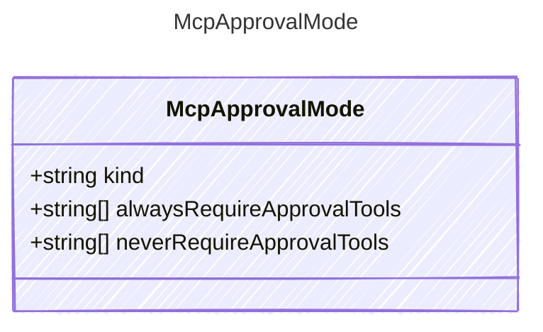

<!-- <auto-generated by typra-emitter> -->
---
title: "McpApprovalMode"
description: "Documentation for the McpApprovalMode type."
slug: "reference/mcpapprovalmode"
---

The approval mode for MCP server tools.
When kind is "specify", use alwaysRequireApprovalTools and neverRequireApprovalTools
to control per-tool approval. For "always" and "never", those fields are ignored.

## Class Diagram



## Yaml Example

```yaml
kind: never
alwaysRequireApprovalTools:
  - operation1
neverRequireApprovalTools:
  - operation2
```

## Properties

| Name | Type | Description |
| ---- | ---- | ----------- |
| kind | string | The approval mode: 'always', 'never', or 'specify' |
| alwaysRequireApprovalTools | string[] | List of tools that always require approval (only used when kind is 'specify') |
| neverRequireApprovalTools | string[] | List of tools that never require approval (only used when kind is 'specify') |

## Alternate Constructions

The following alternate constructions are available for `McpApprovalMode`.
These allow for simplified creation of instances using a single property.

### string kind

Mcp Approval Mode

The following simplified representation can be used:

```yaml
kind: "example"
```

This is equivalent to the full representation:

```yaml
kind:
  kind: "example"
```
