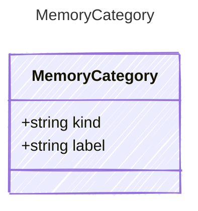

<!-- <auto-generated by typra-emitter> -->

The classification of an agent memory.

`kind` is a general, host-neutral taxonomy: `semantic` (facts and durable
knowledge), `episodic` (specific events or interactions), `procedural`
(skills or how-to), and `preference` (user or agent preferences). A host with
a finer-grained or application-specific taxonomy maps it onto one of these
general kinds and carries the raw label in `label` (or in entry metadata),
rather than introducing an application-specific canonical variant.

## Class Diagram



## Yaml Example

```yaml
kind: semantic
label: project-fact
```

## Properties

| Name | Type | Description |
| ---- | ---- | ----------- |
| kind | string | The general memory category: 'semantic', 'episodic', 'procedural', or 'preference' |
| label | string | Optional finer-grained or host-specific classification within the general kind |

## Alternate Constructions

The following alternate constructions are available for `MemoryCategory`.
These allow for simplified creation of instances using a single property.

### string kind

Memory Category

The following simplified representation can be used:

```yaml
kind: "example"
```

This is equivalent to the full representation:

```yaml
kind:
  kind: "example"
```
