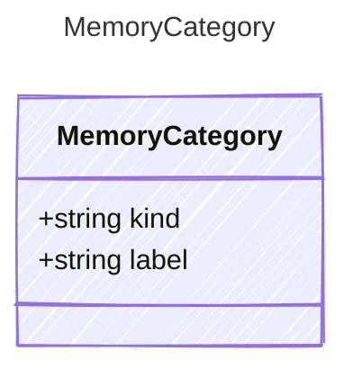

<!-- <auto-generated by typra-emitter> -->

The classification of an agent memory.

`kind` is an open, host-defined classifier: canonical Prompty does not dictate
a fixed taxonomy, so every host expresses its own vocabulary losslessly.
Conventional kinds a host may adopt include `semantic` (facts and durable
knowledge), `episodic` (specific events or interactions), `procedural`
(skills or how-to), and `preference` (user or agent preferences), but any
string is valid. `label` carries an optional finer-grained classification
within a kind. A memory's category is descriptive only — the engine assigns
it no behavioral meaning; any injection/eviction/priority policy keyed on a
particular kind is host policy layered on top of these types.

## Class Diagram



## Yaml Example

```yaml
kind: semantic
label: project-fact
```

## Properties

| Name | Type | Description |
| ---- | ---- | ----------- |
| kind | string | The open, host-defined memory kind (e.g. 'semantic', 'episodic', 'procedural', 'preference', or any host-specific value) |
| label | string | Optional finer-grained or host-specific classification within the kind |

## Alternate Constructions

The following alternate constructions are available for `MemoryCategory`.
These allow for simplified creation of instances using a single property.

### string kind

Memory Category

The following simplified representation can be used:

```yaml
kind: "example"
```

This is equivalent to the full representation:

```yaml
kind:
  kind: "example"
```
