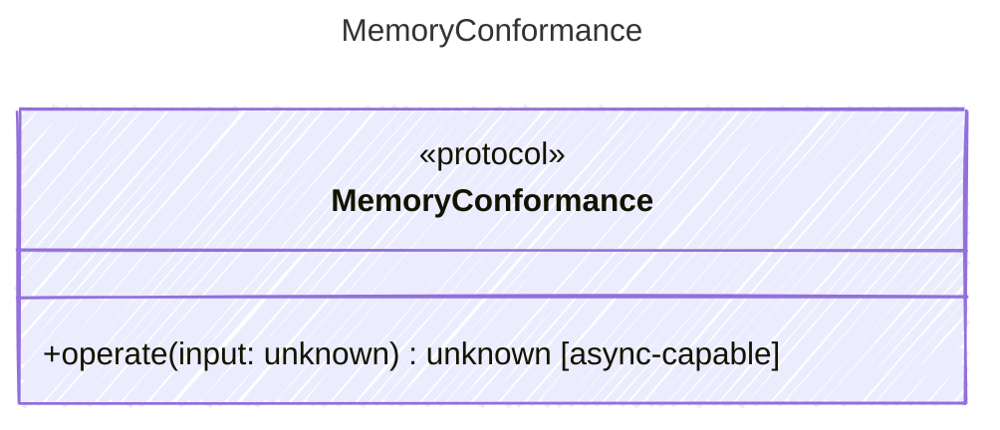

<!-- <auto-generated by typra-emitter> -->

Conformance-only seam that hosts deterministic memory behavior vectors:
recall ranking, mutation policy, formatting, host snapshot persistence, and
memory lifecycle behavior that makes core memories visible to the model.

This exists only to carry vector evidence into vectors.json. Runtime storage
backends, embeddings, indexes, and eviction implementation strategy remain
runtime-owned as long as the observable behavior matches these vectors. Hosts
own persistence by loading and saving whole-store snapshots; runtimes own
deterministic operations over MemoryStore snapshots.

## Class Diagram

## Helper Methods

The following helper methods are declared via `@method` and must be implemented by every runtime. The schema declares the logical protocol contract; each runtime maps async-capable methods to idiomatic sync/async shapes for that language.

| Name | Signature | Runtime shape | Description |
| ---- | --------- | ------------- | ----------- |
| `operate` | `operate(input: unknown) -> unknown` | async-capable | Run a deterministic memory operation against a MemoryStore snapshot |
