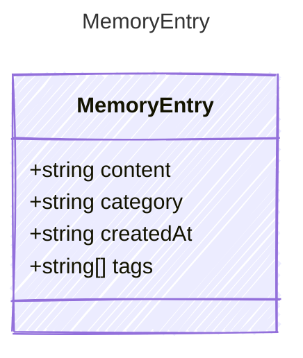

<!-- <auto-generated by typra-emitter> -->

A single agent memory — the canonical, host-neutral unit of agent memory.

`content` is the memory text, `category` places it in a general tier,
`createdAt` records when the memory was formed (intrinsic, portable data), and
`tags` are general labels used for keyword recall, grouping, and core
deduplication. Host-specific associations (for example a session association)
are expressed through the general `tags` field by convention — e.g. a
`session:{id}` tag — never as a canonical field. A host needing per-entry
bookkeeping, a stable id, or a stored embedding vector layers it in host
storage; those are not canonical fields.

## Class Diagram



## Yaml Example

```yaml
content: The user prefers concise answers.
category: core
createdAt: 2026-06-09T20:00:00Z
tags:
  - preference
  - tone
```

## Properties

| Name | Type | Description |
| ---- | ---- | ----------- |
| content | string | The memory content |
| category | string | The general tier of the memory |
| createdAt | string | ISO 8601 UTC timestamp recording when the memory was formed; intrinsic, portable data |
| tags | string[] | General labels for the memory; used for keyword recall, grouping, and core deduplication |
