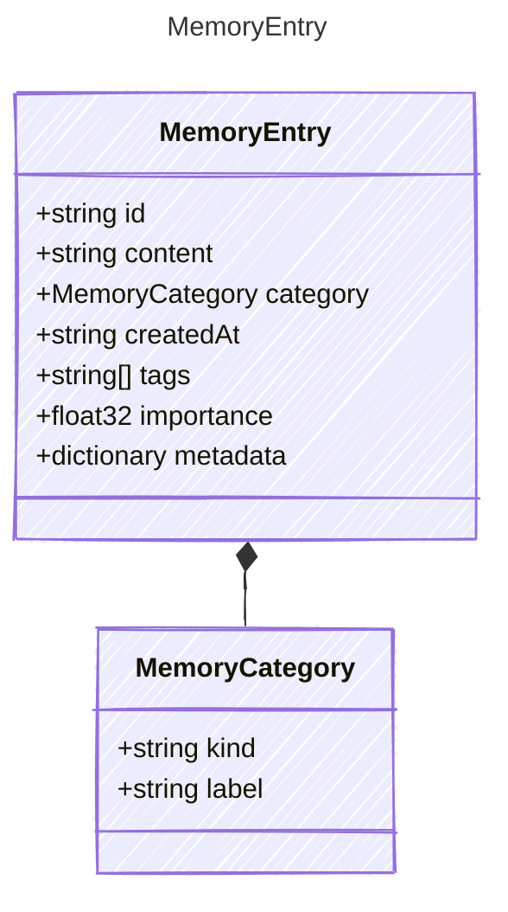

<!-- <auto-generated by typra-emitter> -->

A single agent memory.

The canonical, host-neutral unit of agent memory. `content` is the memory
text; `category` classifies it; `createdAt`, `tags`, and `importance` are
intrinsic scoring inputs consumed by deterministic recall. Any host-specific
bookkeeping (source, session association, application taxonomy, or a stored
embedding vector for host-side vector recall) lives in `metadata`, never as a
canonical field.

## Class Diagram



## Yaml Example

```yaml
id: mem-0001
content: The user prefers concise answers.
category:
  kind: preference
createdAt: 2026-06-09T20:00:00Z
tags:
  - preference
  - tone
importance: 0.8
```

## Properties

| Name | Type | Description |
| ---- | ---- | ----------- |
| id | string | Stable unique identifier for the memory |
| content | string | The memory content |
| category | [MemoryCategory](../memorycategory/) | The classification of the memory |
| createdAt | string | ISO 8601 UTC timestamp when the memory was created; consumed as a recency input by recall |
| tags | string[] | General labels for the memory; consumed as keyword inputs by recall |
| importance | float32 | Optional salience weight in the range 0..1; consumed as a ranking input by recall |
| metadata | dictionary | Opaque host-specific memory metadata (e.g. source, session association, raw application taxonomy, or a stored embedding vector for host-side vector recall) |

## Composed Types

The following types are composed within `MemoryEntry`:

- [MemoryCategory](../memorycategory/)
