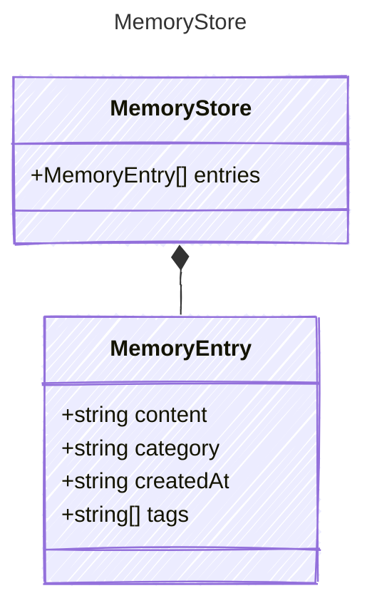

<!-- <auto-generated by typra-emitter> -->

A whole-store snapshot of agent memory.

The canonical persisted shape a host loads and saves as one unit. A host
backend implements only load/save of this snapshot; the engine owns the
deterministic recall, formatting, tiered injection, eviction, and
entry-mutation logic on top of it.

## Class Diagram



## Yaml Example

```yaml
entries: []
```

## Properties

| Name | Type | Description |
| ---- | ---- | ----------- |
| entries | [MemoryEntry[]](../memoryentry/) | The memories held in the store, in insertion order |

## Composed Types

The following types are composed within `MemoryStore`:

- [MemoryEntry](../memoryentry/)
