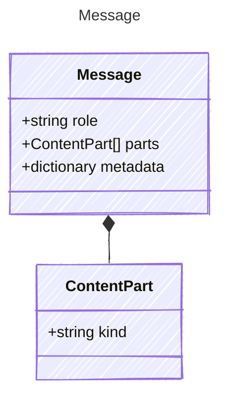

A message in a conversation. Messages have a role and a list of content parts
representing the different modalities of the message content.

## Class Diagram



## Yaml Example

```yaml
role: user
parts:
  - kind: text
    value: Hello!
metadata:
  source: user-input
```

## Properties

| Name | Type | Description |
| ---- | ---- | ----------- |
| role | string | The role of the message sender |
| parts | [ContentPart[]](../contentpart/) | The content parts of the message(Related Types: [TextPart](../textpart/), [ImagePart](../imagepart/), [FilePart](../filepart/), [AudioPart](../audiopart/)) |
| metadata | dictionary | Optional metadata associated with the message |

## Helper Methods

The following helper methods are declared via `@method` and must be implemented by every runtime. Idiomatic language shape (e.g. zero-param accessor may be a property) is chosen per-language by the emitter.

| Name | Signature | Description |
| ---- | --------- | ----------- |
| `toTextContent` | `toTextContent() -> unknown` | Return plain string if all parts are text, else a list of content part dicts for wire serialization |
| `text` | `text() -> string` | Concatenate all TextPart values joined by newline |

## Factory Methods

The following factory methods are declared via `@factory` and are generated automatically by the emitter in every language.

- `assistant(text: string)`
- `system(text: string)`
- `user(text: string)`

## Composed Types

The following types are composed within `Message`:

- [ContentPart](../contentpart/)
