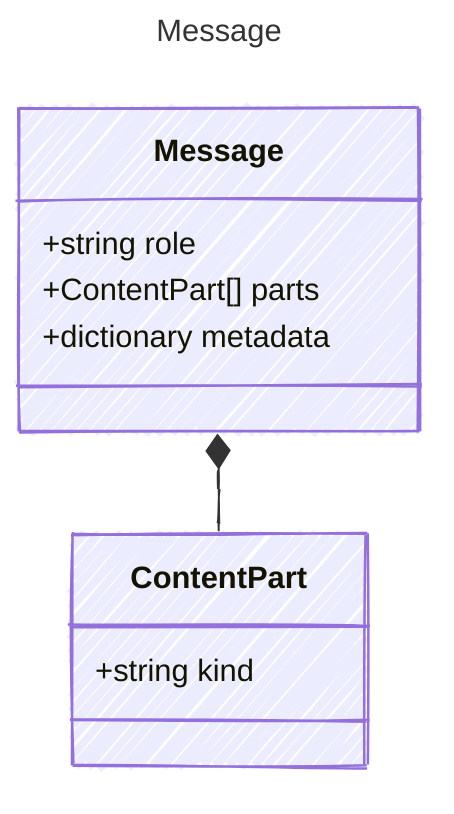

A message in a conversation. Messages have a role and a list of content parts
representing the different modalities of the message content.

## Class Diagram



## Yaml Example

```yaml
role: user
parts:
  - kind: text
    value: Hello!
metadata:
  source: user-input
```

## Properties

| Name | Type | Description |
| ---- | ---- | ----------- |
| role | string | The role of the message sender |
| parts | [ContentPart[]](../contentpart/) | The content parts of the message(Related Types: [TextPart](../textpart/), [ImagePart](../imagepart/), [FilePart](../filepart/), [AudioPart](../audiopart/)) |
| metadata | dictionary | Optional metadata associated with the message |

## Composed Types

The following types are composed within `Message`:

- [ContentPart](../contentpart/)
