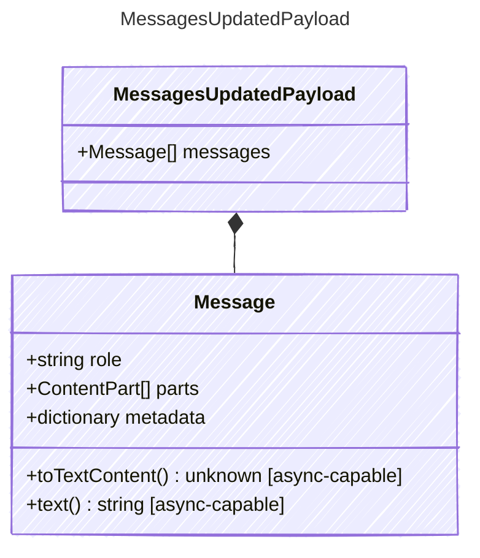

Payload for "messages_updated" events — the conversation state has changed.

## Class Diagram

## Properties

| Name | Type | Description |
| ---- | ---- | ----------- |
| messages | [Message[]](../message/) | The current full message list after the update |

## Composed Types

The following types are composed within `MessagesUpdatedPayload`:

- [Message](../message/)
