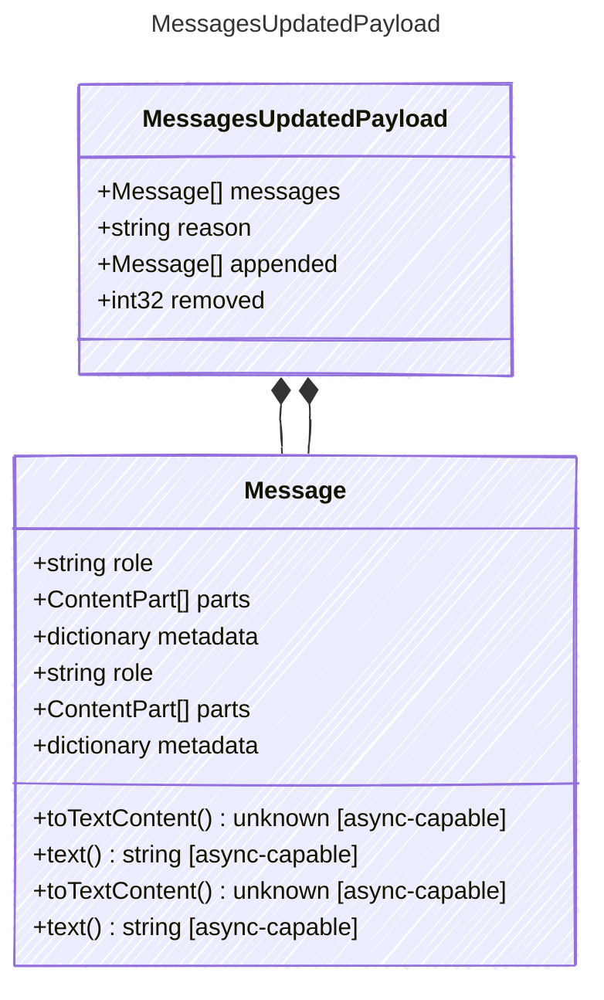

<!-- <auto-generated by typra-emitter> -->

Payload for "messages_updated" events — the conversation state has changed.

## Class Diagram



## Yaml Example

```yaml
reason: tool_results
removed: 2
```

## Properties

| Name | Type | Description |
| ---- | ---- | ----------- |
| messages | [Message[]](../message/) | The current full message list after the update |
| reason | string | Why the message list changed |
| appended | [Message[]](../message/) | Messages appended by this update, when available |
| removed | int32 | Number of messages removed by this update, when available |

## Composed Types

The following types are composed within `MessagesUpdatedPayload`:

- [Message](../message/)
- [Message](../message/)
