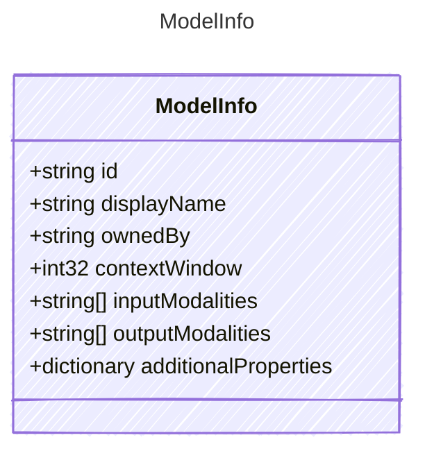

Information about a model available from a provider. Used by provider-level
model discovery to report which models are available and their capabilities.

Not all providers return all fields — implementations SHOULD populate as
many fields as the provider&#39;s API supports and MAY enrich sparse results
from a built-in lookup table of known models.

## Class Diagram



## Yaml Example

```yaml
id: gpt-4o
displayName: GPT-4o
ownedBy: openai
contextWindow: 128000
inputModalities:
  - text
  - image
outputModalities:
  - text
additionalProperties:
  supportsStreaming: true
```

## Properties

| Name | Type | Description |
| ---- | ---- | ----------- |
| id | string | The model identifier (e.g., &#39;gpt-4o&#39;, &#39;claude-3-opus&#39;) |
| displayName | string | Human-readable display name |
| ownedBy | string | The organization or entity that owns the model |
| contextWindow | int32 | Maximum context window size in tokens |
| inputModalities | string[] | Input modalities the model accepts (e.g., &#39;text&#39;, &#39;image&#39;, &#39;audio&#39;) |
| outputModalities | string[] | Output modalities the model can produce (e.g., &#39;text&#39;, &#39;audio&#39;) |
| additionalProperties | dictionary | Additional provider-specific properties |
