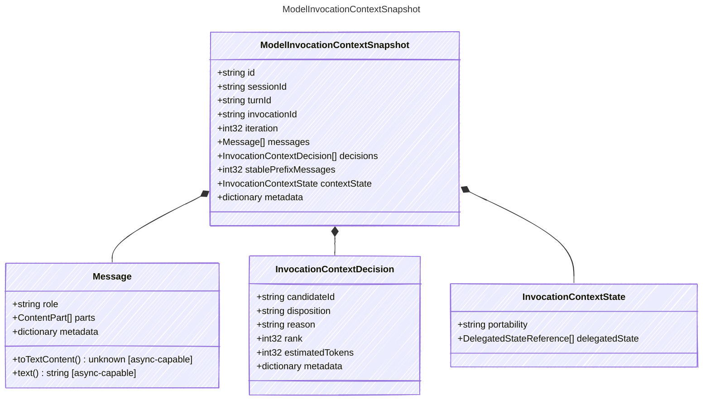

<!-- <auto-generated by typra-emitter> -->

Immutable model-visible context for a single provider invocation.

Retries of the same invocation MUST reuse the same snapshot.

## Class Diagram



## Yaml Example

```yaml
id: context:inv_abc123
sessionId: sess_abc123
turnId: turn_abc123
invocationId: inv_abc123
```

## Properties

| Name | Type | Description |
| ---- | ---- | ----------- |
| id | string | Stable identifier for this context snapshot |
| sessionId | string | Stable session identifier |
| turnId | string | Stable turn identifier |
| invocationId | string | Stable model invocation identifier |
| iteration | int32 | Zero-based model loop iteration |
| messages | [Message[]](../message/) | Canonical messages visible to the model |
| decisions | [InvocationContextDecision[]](../invocationcontextdecision/) | Context-planning decisions used to assemble the snapshot |
| stablePrefixMessages | int32 | Number of leading messages eligible for provider prefix-cache reuse |
| contextState | [InvocationContextState](../invocationcontextstate/) | Provider-context state carried into this invocation |
| metadata | dictionary | Opaque host-specific snapshot metadata |

## Composed Types

The following types are composed within `ModelInvocationContextSnapshot`:

- [Message](../message/)
- [InvocationContextDecision](../invocationcontextdecision/)
- [InvocationContextState](../invocationcontextstate/)
