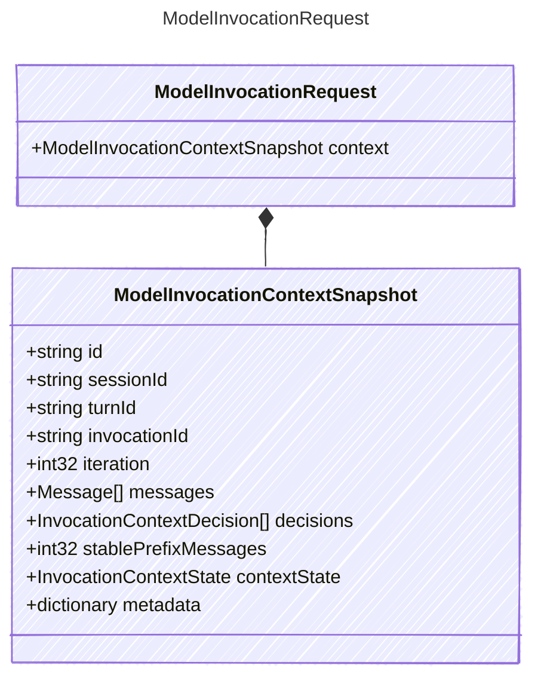

<!-- <auto-generated by typra-emitter> -->

Normalized request for a single model-provider invocation.

## Class Diagram

## Properties

| Name | Type | Description |
| ---- | ---- | ----------- |
| context | [ModelInvocationContextSnapshot](../modelinvocationcontextsnapshot/) | Immutable model-visible context for this invocation |

## Composed Types

The following types are composed within `ModelInvocationRequest`:

- [ModelInvocationContextSnapshot](../modelinvocationcontextsnapshot/)
