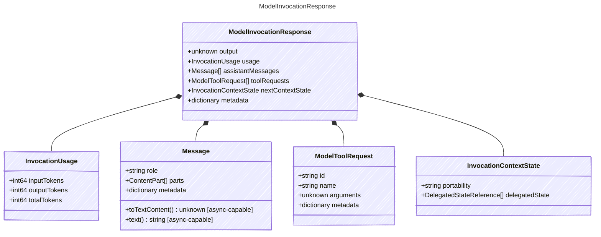

<!-- <auto-generated by typra-emitter> -->

Provider-neutral result of a single model invocation.

This is the live provider boundary. It is intentionally distinct from
TurnModelResponse, which is the deterministic reference-runner callback.

## Class Diagram

## Properties

| Name | Type | Description |
| ---- | ---- | ----------- |
| output | unknown | Provider-neutral final output when no additional tool calls are requested |
| usage | [InvocationUsage](../invocationusage/) | Complete cumulative token usage for this completed invocation, when available |
| assistantMessages | [Message[]](../message/) | Assistant messages to commit before tool results are made visible |
| toolRequests | [ModelToolRequest[]](../modeltoolrequest/) | Tool requests returned by the provider |
| nextContextState | [InvocationContextState](../invocationcontextstate/) | Provider-context state to carry into the next invocation |
| metadata | dictionary | Opaque provider-specific response metadata |

## Composed Types

The following types are composed within `ModelInvocationResponse`:

- [InvocationUsage](../invocationusage/)
- [Message](../message/)
- [ModelToolRequest](../modeltoolrequest/)
- [InvocationContextState](../invocationcontextstate/)
